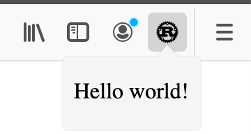

# 🦀 + Yew + 🦊 = ¯\\\_ツ\_/¯️

## About

This little example shows how to build a firefox extension using Yew and wasm-pack. 

## 🚴 Usage

### 🛠️ Build

When building for the first time, ensure to install dependencies first.

```
yarn install
```

```
yarn run build
```

### 🔬 Serve locally

```
yarn run start:dev
```

### 🦊 Run as a plugin

```
yarn run web-ext
```

</img>

## References

This example was based on [yew-wasm-pack-minimal](https://github.com/yewstack/yew-wasm-pack-minimal) and [yew-wasm-pack-template](https://github.com/yewstack/yew-wasm-pack-template).
